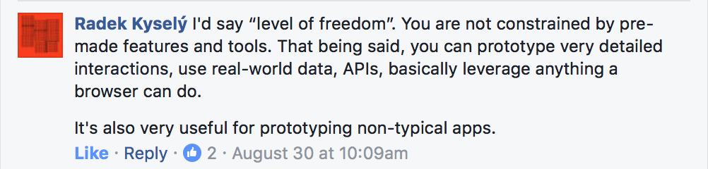
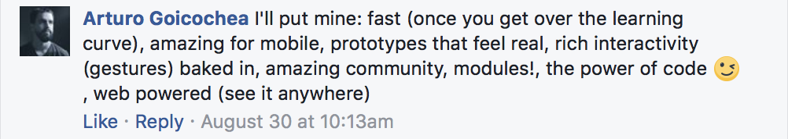
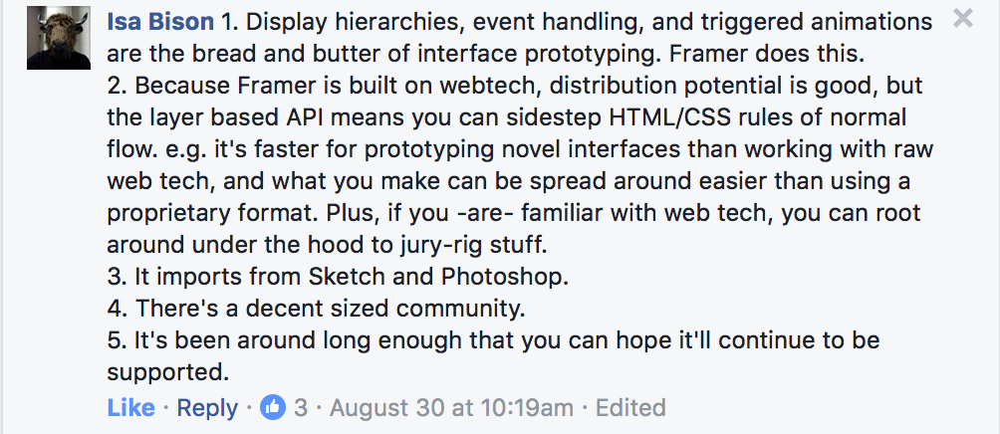
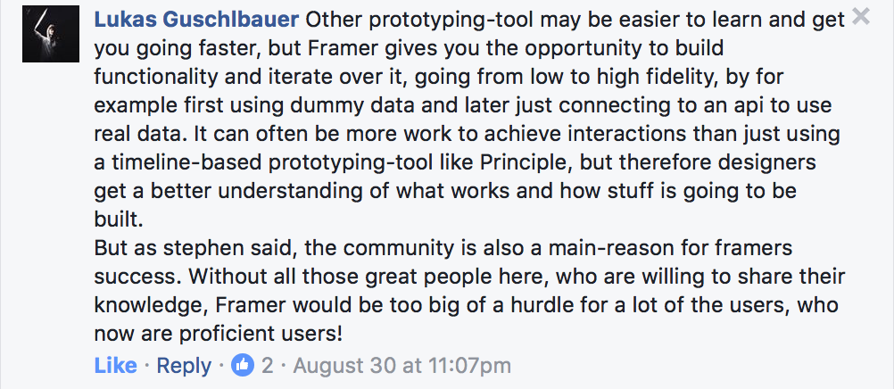
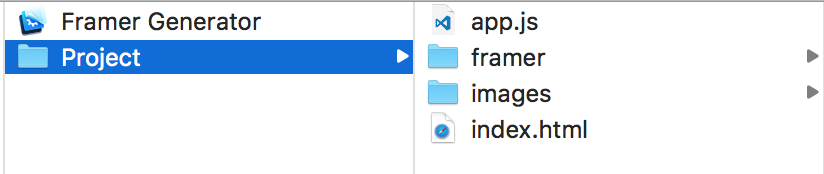
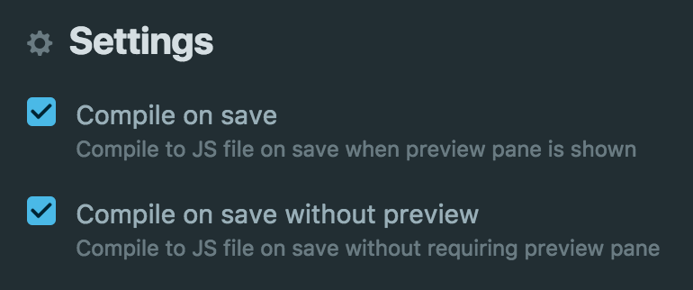

**::::::::: DRAFT :::::::::**

Ver status en: [Status Curso Framer](https://docs.google.com/spreadsheets/d/13WpVO5qfp_j7b94xdRIdzHhDC-smxiMNW9koRcQDQwI/edit?usp=sharing)

**:::::::::::::::::::::::::**

# Semana 1 - Unidad 01: Introducción a Framer

TBD min

Una introducción a Framer.JS, cómo funciona, lo que puedes crear con Framer y cómo usarlo.

| # | Tipo | Duración | Tópico
| - | ---- | -------- | ------
| 01 | Lectura | ? min | [Introducción a Framer](#)

## Introduccion a Framer

### Agenda

* Qué es Framer
* Por qué Framer
* Cómo usaremos Framer.JS
* Ejemplos creados con Framer

### Qué es Framer

“Framer Library” o Framer.JS es un framework open source de JavaScript para crear prototipos de alta fidelidad. Usalo para diseñar animaciones e interacciones sin ninguna limitante. Usa “real spring physics” o anima con efectos 3D, todo es posible.

Luego, tambien existe Framer (antes llamado Framer Studio), que es un app para Mac.


Framer (el app de Mac), es una herramienta de diseno para Mac que te permite diseñar sin límites. Está basada en Framer Library, y ofrece la familiaridad de un editor gráfico con la flexibilidad del código. Incluye un previsualizador de dispositivo, versión control, y compartir con un solo click.

### Cuél es realmente la diferencia

En cuanto a usar las capacidades de Framer como framework de JavaScript, ninguna. El app de Mac lo hace un poco mas facil y autmoatizado, ademas de añadir un modo de diseño. Luego, puedes crear lo mismo.

### Por qué Framer

* **El poder del código**: Lo que separa a Framer del resto, es que tienes el poder y flexibilidad del codigo a tu disposición. Y el framework está hecho de tal forma que hace construir prototipos mas facil y rapido.
* **El poder de la comunidad**: La comunidad de personas que usa Framer también es genial. Verás que quien lo usa, lo ama y defiende...y le encanta ayudar. El grupo de Facebook de Framer es gran prueba de ayuda, donde se publican preguntas y comparten proyectos.

Pregunte en el grupo de Framer en Facebook...por que Framer. Esto es lo que me respondieron (incluido el mio):







### CoffeeScript

Framer, si bien es un framework de JavaScript, ha sido diseñado para ser usado con CoffeeScript.

Igual que puedes usar Sass o Less y transpilarlos a CSS, con CoffeeScript sucede lo mismo, convirtiéndolo luego a JavaScript.

Esto significa que el codigo que usaremos en Framer sera un poco diferente. Esto fue hecho porque, en su momento, JavaScript no era tan amigable (ahora tenemos ES6).

### Cómo usaremos Framer.JS

Aqui los pasos que seguiremos para iniciar un proyecto de Framer.JS.

1. [Descarga](https://builds.framerjs.com/version/latest/Framer.zip?utm_source=GitHub%2C%20framerjs%2C%20readme&utm_medium=Github) la ultima versión estable de Framer
2. Verás que haz descargado un folder con esto:



A lo que tenemos que prestarle atención realmente es al folder "project". Y específicamente, el archivo con el que trabajaremos es "app.js".

3. Antes de abrir "app.js", cambia su nombre a "app.coffee".
4. Te recomiendo usar el editor de texto Atom y la extension "coffee-compile". Lo que esto hará es permitirnos trabajar con un archivo CoffeeScript, y cada vez que guardes tu archivo, lo compilará en JS. Esto se puede hacer también vía el Command Line o Terminal, pero con esta extensión es mucho mas rápido.

Una vez que hayas instalado la extension "coffee-compile", asegurate de que esten marcadas estos checkboxes en los settings de la extension:



*¿Por qué no usar js?*: si bien Framer.JS es un framework de JS, como Framer (el app), usa CoffeeScript, todos los tutoriales y ejemplos que encontrarás online también lo usan.

5. Con eso ya esta todo listo para prototipar con Framer. Lo único que tienes que hacer es trabajar en el archivo app.coffee, y ver tu prototipo abrir index.html.

6. Para hacer nuestro trabajo mas fácil, usaremos Browser-Sync para que tu archivo index.html se refresque automaticamente cada vez que guardas.

Instalalo [Browser-sync](http://browsersync.io/).
Corre en tu Command Line (Windows) o Terminal (Mac) una vez hayas navegado al folder del proyecto:

```
browser-sync start --server  --files "*.coffee"
```

Estos pasos fueron tomados del blog post [Framer on Windows with Atom](http://www.prototypingwithframer.com/framer-on-windows-with-atom/)

7. Para terminar este tutorial, haremos un par de cosas:

* Aprenderemos como usar dispositivos para nuestros proyectos
* Aprenderemos que es el comando `print` y para que lo usaremos.

Para usar dispositivos, usaremos este código:

```
Device = new DeviceComponent
Device.setupContext()
Device.deviceType="apple-watch-38mm-gold-midnight-blue-closed"
```

En la tercera línea es que estamos definiendo el dispositivo que queremos usar. Puedes buscar el string para otros dispositivos en los [docs de Framer](https://framer.com/docs/#device.device).

Por ultimo, pega este código:

```
print 'Hello world'
```

El comando print sera útil para saber cuando nuestro código no está corriendo, ya que si no corre el comando print, es porque algo falló antes.


### Ejemplos creados con Framer

Estos son algunos ejemplos de lo que puedes crear con Framer. Presta atencion a lo que es posible, y luego te invito a abrir los proyectos en tu editor de texto y trates de empezar a entender el codigo.

* [Gboard](http://share.framerjs.com/7x6dd91j7fwa/)
* [Facebook Live](http://share.framerjs.com/zmiyvyehoc5c)
* [Twitter Redesign: Immersive Media](https://dribbble.com/shots/3581130-Twitter-Redesign-Immersive-Media)
* [Headspace](https://dribbble.com/shots/3642415-Tile-Mask)
* [Transitions Test by Claudio Guglieri](https://dribbble.com/shots/3698408-Transitions-Test-Vote-for-your-favorite)
* [Animation Experiment 3](https://dribbble.com/shots/3667269-Animation-Experiment-3)
* [Meizu Grid experiment by Claudio Guglieri](https://framer.cloud/mGlDs)
* [Flow](https://framer.cloud/bOnIx)
* [Loading](https://framer.cloud/ZgoyH)
* [Notificaciones](https://framer.cloud/fjAUY/)
* [Transiciones](https://framer.cloud/QcHRZ/)
* [Scroll y esconder](https://framer.cloud/nvTZi/)
* [Páginas](https://framer.cloud/mCgFk)

