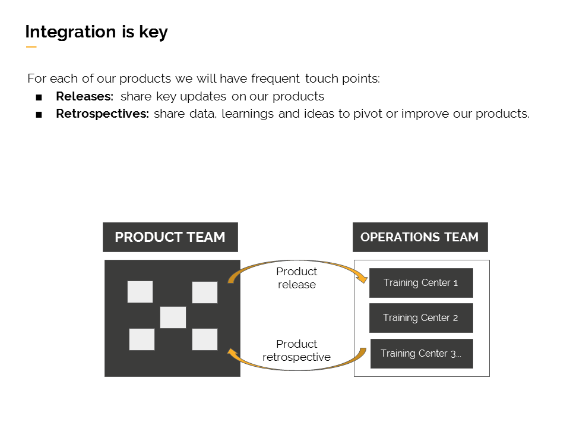

# Perfil del profesor de Eduación Continua

Como te mencionamos anteriormente en este módulo aprenderás sobre Educación Continua y sobre lo que esperamos de ti como profesor.

### ¿Qué es Educación Continua?

Educación Continua es el proceso de formación de alrededor 18 meses, al que acceden nuestras alumnas una vez terminado el bootcamp. En esta etapa las coders tiene la posibilidad de seguir profundizando algunos temas vistos previamente y/o aprender nuevas temáticas que le permitirán seguir creciendo como desarrolladoras.

## INSERTAR VIDEO CARO

### Temáticas de los cursos

Nuestro core es continuar con la capacitación de la línea Full Stack JavaScripts y a la vez ofrecer cursos que sean de interés en el mundo digital y de tecnología. Algunos de los cursos que ya están definidos van en la siguiente línea:

#### Full Stack JavaScript
       JS Deep Dive, Paradigmas de Programación, Functional JS, React, Redux, The Web Stack, Angular	

#### Digital/Tecnología 
       UXD 1, UXD 2, UX Research, UX Prototyping, UX Ideation, Visualización de datos, SEO, Marketing Digital
              
#### English 4 Developers (E4D)
       Rookie 1, Rookie 2,Rookie 3, Electivos

Estamos  abiertos a cualquier propuesta o idea de cursos siempre en la línea de entregar skills en la nueva era digital.

La coder puede tomar los cursos del área que quiera siempre y cuando, cumplan con dos requisitos:
1) El mismo mes no pueden tomar más de un curso tecnológico. Si pueden tomar uno de la línea Full Stack más uno de E4D, pero no uno de UX y otro de JS.
2) Cumplir los pre-requisitos de ese curso en particular.

### ¿Cómo son los cursos de educación continua en Laboratoria?

En Laboratoria hemos creado una metodología para los cursos, para que nuestras alumnas aprendan de manera rápida y eficiente todo lo que queremos enseñarle en un mes. 

La modalidad de estos cursos la hemos llamado "4x4". Esto significa que los cursos duran cuatro semanas y cuatro horas aproximadamente cada semana. Tres de estas horas serán presenciales y la hora restante se puede realizar desde dónde la alumna quiera. 

Los cursos de tecnología por lo tanto están creados para durar 1 mes: 3 horas presenciales + 1-2 horas on-line a la semana.
Los 6 primeros meses de E4D tendrán una modalidad diferente. Tienen una duración de 2 meses y contemplan 6 horas a la semana presenciales más 1-2 on-line. Estos cursos de dos meses son los denominados Rookie. 

En todos nuestros cursos las alumnas pueden desarrollar un proyecto/producto concreto que les permitirá mostrar el resultado de su aprendizaje a quién ellas quieran.

Actualmente el programa de Educación Continua se está desarrollando en 3 de nuestras 5 sedes: 
Lima 
Santiago de Chile
Ciudad de México

### Bootcamp

### Perfil de nuestras alumnas DANI

Nuestras coders han pasado por el bootcamp de 6 meses de Laboratoria. El contenido del bootcamp incluye materia de desarrollo web junto con talleres de habilidades socio-emocionales dirigido por nuestras sicólogas.
Hemos creado una manera de enseñar que la hemos denominado "Metodologia Agil". Para más información sobre esta, haz click aquí
https://medium.com/laboratoria/the-agile-classroom-embracing-an-agile-mindset-in-education-ae0f19e801f3

Posterior al bootcamp empieza el proceso de inserción laboral que se inicia con nuestro "Talent Fest". Dentro del Talent Fest realizamos una hackaton donde distintas empresas ponen retos a nuestras alumnas y tiene la posibilidad de ver en vivo y en directo el talento de ellas. Actualmente el 75% en promedio de las egresadas lográn la inserción, pero esperamos que este porcentaje aumente a 80%.

### Producto & Operaciones

Como ya viste en la presentación del módulo anterior, en Laboratoria trabajamos en dos equipos separados pero que son muy complementarios: Productos y Operaciones. 

Es de suma importancia que el ciclo de un curso se cierre, esto quiere decir que parte con una demanda real, se crea, se ejecuta y se de feedback para una futura versión. La retroalimentación que nos des clase a clase va a ser fundamental para la calidad de las alumnas.

[SIGUIENTE](02-perfilprofesor.md)

