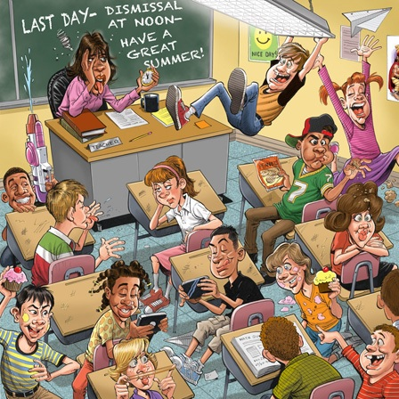

## ¡Bienvenido a tu capacitación pedagógica!

Muchas veces nos pasa que llegamos a nuestras clases muy motivados, pero en el camino nos damos cuenta que nuestros alumnos no siguen la clase. Nosotros, los profesores, empezamos a perder el rumbo de la clase. 
Por eso mismo hemos diseñado esta pequeña inducción para ayudarte a tener una clase más efectiva.
 

Los cursos de Educación Continua utilizan la metodología ABP (Aprendizaje Basado en Productos) donde los estudiantes se enfocan en un producto en el transcurso del curso. Este producto hace que el alumno esté activo en el proceso de aprendizaje lo cual lo hace más significativo. 
Te invitamos a ver este video que ayudará a ejemplificar de mejor manera esta metodología.  

### META FINAL DE LA SESIÓN

“Aplicar técnicas pedagógicas en mis clases para tener una mayor efectividad en ellas a través de la práctica y acompañamiento del Training Manager” 

### TÉCNICAS EFECTIVAS PARA UNA CLASE

Para esta sesión identificamos seis elementos claves para una clase. Cada uno de estos elementos serán explicados a continuación.

| # | Tipo | Tópico
| - | ----- | -----
| 01 | Lectura | a) ¿Cómo crear el objetivo de una clase?
| 02 | Lectura | b) ¿Cómo planificar una clase efectiva?
| 03 | Lectura | c) ¿Cómo estructurar una clase eficiente?
| 04 | Lectura | d) ¿Cómo crear una “Agenda” clara?
| 05 | Lectura | e) ¿Cómo dar instrucciones claras?
| 06 | Lectura | f) ¿Cómo verificas que tus alumnos comprendieron el contenido?

[EMPEZAR](02-creacioncontenido.md)
