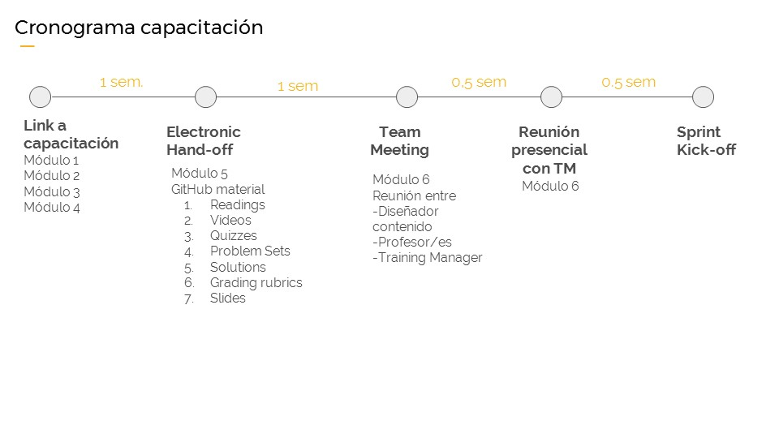

## Capacitación Técnica

En esta etapa de nuestro curso para profesores de Educación Continua, ha llegado el punto en el que invitamos a estudiar el contenido del curso que vas a dictar. Es decir, ya te estudiaste el Módulo 1, 2,3 y 4 de este curso.

Cuando llegues a este punto, comunícate con tu TM para que te haga entrega oficial del contenido: "Hand off". Para esta paso tendrás 1 semana como lo muestra al siguiente diagrama:

Esperamos que te entretengas muchisimo leyendo el contenido, al igual que lo hicimos nosotros cuando lo creamos!

El paso posterior será la "Team meeting". en la cual te reunirás con el encargado del contenido del curso por parte de Laboratoria junto a tu trainig manager, donde podrás realizar todas las consultas de contenido que tengas.
Las preguntas de forma, planificación, agenda día a día, serán respondidas por tu training manager de manera posterior y NO serán tocadas en este reunión en específico.

Al terminar la "Team meeting" tu TM se coordinará contigo para la última reunión presencial,la cuál marcará el cierre de esta capacitación.

[VAMOS?](../06-reuniontm/listareunion.md)
